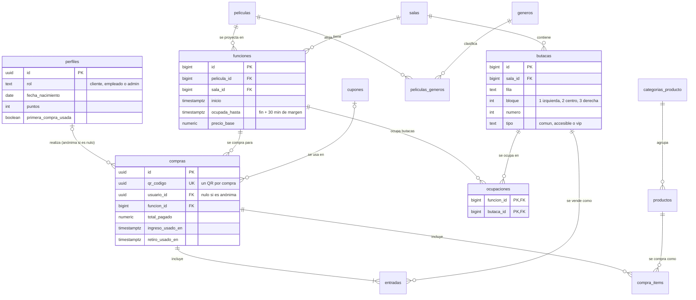

# Cinenice

> Sistema web de venta de entradas y Candy Bar para un cine — TP N.º 1, Programación IV, UTN Facultad Regional Avellaneda.

**Deploy:** https://app-cinenice-tp-1-prograiv-tobias-s.vercel.app/
**Repositorio:** https://github.com/TobiasSCHM/AppCinenice-TP1-PROGRAIV-TobiasSchmidt

| | |
|---|---|
| **Autor** | Tobias Schmidt |
| **Comisión** | 141 |
| **Docente** | Ricardo Gastón Plazas |
| **Fecha de entrega** | 13/10/2026 |

---

## Usuarios de prueba

| Rol | Correo | Contraseña |
|---|---|---|
| Administrador | `admin@cinenice.test` | `admin123` |
| Empleado | `empleado@cinenice.test` | `admin123` |
| Cliente | `cliente@cinenice.test` | `admin123` |

> Cliente anónimo: no necesita cuenta, se puede comprar sin registrarse.

---

## Tecnologías

| Tecnología | Versión | Para qué se usa |
|---|---|---|
| Angular | `^22.1` | Framework de la aplicación (standalone, signals, control flow, Signal Forms) |
| TypeScript | `~6.0` | Tipado estricto en todo el código |
| Supabase (`@supabase/supabase-js`) | `^2.117` | Auth (correo y Google), base de datos Postgres, Realtime, Storage y RPC |
| RxJS | `~7.8` | Dependencia de Angular. La app maneja su estado con signals, no con streams |
| Vitest + jsdom | `^4.0` / `^28.0` | Pruebas unitarias de las reglas críticas |
| PWA (service worker) | — | Instalación y cartelera offline (en desarrollo) |
| Vercel | — | Despliegue continuo desde la rama `main` |

---

## Cómo correrlo localmente

**Requisitos:** Node.js 24.x (Angular 22 exige `^22.22.3`, `^24.15` o `>=26`) y npm.

```bash
git clone https://github.com/TobiasSCHM/AppCinenice-TP1-PROGRAIV-TobiasSchmidt.git
cd AppCinenice-TP1-PROGRAIV-TobiasSchmidt
npm install
npm start          # http://localhost:4200
npm test           # pruebas unitarias
npm run build      # compilación de producción (carpeta dist/cine/browser)
```

**Configuración de Supabase:** el proyecto no usa variables de entorno de proceso. La URL y la clave pública (anon) se leen de `src/environments/environment.ts` (desarrollo) y `src/environments/environment.prod.ts` (producción, que lo reemplaza en el build mediante `fileReplacements` de `angular.json`).

| Campo | Descripción |
|---|---|
| `supabaseUrl` | URL del proyecto de Supabase |
| `supabaseAnonKey` | Clave pública (anon). Está pensada para ser pública: lo que protege los datos es Row Level Security. La clave `service_role` nunca se usa ni se publica |


**Usuarios y roles:** los usuarios se crean desde la app (`/registro`) o desde Authentication de Supabase. Los roles `admin` y `empleado` no se pueden elegir desde la app: se asignan con SQL.

```sql
update public.perfiles set rol = 'admin'    where email = 'admin@cinenice.test';
update public.perfiles set rol = 'empleado' where email = 'empleado@cinenice.test';
```

---

## Arquitectura

### Estructura de carpetas

```
src/app/
├── core/               Lógica de la aplicación, sin pantallas
│   ├── *.service.ts    Servicios singleton de acceso a datos (auth, películas, funciones, salas,
│   │                   butacas, ocupación, productos, configuración)
│   ├── guards/         authGuard, guestGuard, adminGuard, empleadoGuard
│   ├── models/         Interfaces TypeScript del modelo de datos
│   ├── pipes/          duracion, precioArs, edad
│   ├── utils/          Funciones puras: fechas, texto, precios, armado del mapa, errores, storage
│   └── validators/     Fecha de nacimiento, separación de funciones, butacas contiguas
├── shared/             Piezas reutilizables: mapa-butacas, resumen-compra, errores-campo
│                       y la directiva appHighlightButaca
├── pages/              Pantallas públicas: cartelera, pelicula-detalle, funcion-mapa,
│                       login, registro, completar-perfil
├── admin/              Módulo con carga diferida: películas, salas, funciones, Candy Bar, configuración
└── empleado/           Módulo con carga diferida: validación de QR

supabase/migrations/    Esquema, funciones, políticas RLS y datos de ejemplo (001 a 007)
```

### Separación de responsabilidades

- **Acceso a datos:** los servicios de `core/` son el único lugar que habla con Supabase. Los componentes nunca llaman a la API directamente.
- **Estado:** vive en signals (`signal`, `computed`, `effect`) dentro de los servicios y de las páginas. Todo lo derivado (resultados del buscador, validación de butacas, totales) es un `computed`.
- **Presentación:** componentes como `MapaButacas` y `ResumenCompra` solo reciben datos por `input()` y avisan por `output()`. No conocen Supabase.
- **Reglas de negocio:** las reglas críticas están como **funciones puras** (`validarContiguas`, `calcularPrecios`, `armarFilas`, `errorFechaNacimiento`, `primeraSalaLibre`) con tests, y las decisivas se repiten en la base de datos.

### Modelo de datos



Tablas de apoyo no dibujadas: `configuracion` (parámetros editables del negocio), `cupones_usos`, `recompensas`, `puntos_movimientos`, `creditos_movimientos`, `resenas`, `alertas_estreno`, `combos`, `combos_items` y `activity_log` (registro de actividad).

---

## Decisiones técnicas

> Formato: **qué se decidió → por qué → qué alternativa se descartó.** Una ficha por decisión.

### 1. La lógica crítica vive en Postgres, no en Angular
- **Decisión:** la asignación de sala, los solapamientos de funciones, la confirmación de la compra y los permisos se resuelven en la base de datos (funciones SQL, `EXCLUDE`, RPC y RLS).
- **Motivo:** la interfaz puede saltearse: cualquiera puede llamar a la API sin pasar por Angular. La base es la única fuente de verdad. Además hay menos código en el frontend.
- **Alternativa descartada:** validar solo en Angular, o usar Edge Functions (más piezas para desplegar y sin acceso transaccional directo a las tablas).
- **Requerimientos vinculados:** RF-17, RF-23, RN-04, RN-32, RNF-09.

### 2. Compra atómica con una única RPC `security definer`
- **Decisión:** `confirmar_compra` ocupa las butacas, crea la compra, las entradas y los productos, aplica el cupón y acredita los puntos en una sola transacción. Es el único camino para escribir en `compras`, `entradas` y `ocupaciones`: esas tablas no tienen escritura directa para ningún rol.
- **Motivo:** la compra se confirma completa o no se confirma (RN-32). Si algo falla, no queda nada guardado.
- **Alternativa descartada:** varias llamadas desde el cliente (podrían dejar una butaca ocupada sin compra) o una Edge Function.
- **Requerimientos vinculados:** RF-23, RF-04, RN-32.

### 3. El servidor recalcula los precios
- **Decisión:** el cliente solo envía qué quiere comprar (función, butacas, productos con cantidad). El precio base, el recargo VIP, el descuento y los puntos salen de las tablas. El total que se ve en pantalla es una estimación.
- **Motivo:** manipular el navegador no puede cambiar lo que se cobra.
- **Alternativa descartada:** confiar en el total que envía el cliente.
- **Requerimientos vinculados:** RF-20, RF-22, RF-30, RF-32.

### 4. Asignación automática de sala con doble defensa
- **Decisión:** una función SQL busca la primera sala libre respetando 30 minutos de margen, y un `EXCLUDE USING gist` sobre (sala, rango de ocupación) actúa como red de seguridad ante dos admins simultáneos. `fin` y `ocupada_hasta` los calcula un trigger.
- **Motivo:** el usuario recibe un mensaje claro y la base garantiza que nunca haya solapamiento. Se guarda `ocupada_hasta` como columna porque una expresión con `timestamptz + interval` no es inmutable y no puede usarse en el índice.
- **Alternativa descartada:** que el admin elija la sala a mano (RN-05 lo prohíbe) o validar solo en el cliente.
- **Requerimientos vinculados:** RF-17, RN-04, RN-05.

### 5. Recurrencia de funciones «todo o nada»
- **Decisión:** una recurrencia semanal crea todas sus funciones o ninguna, y el error nombra la fecha conflictiva. Los horarios que ya pasaron se saltean. Los días y las horas se eligen con chips, sin calendario desplegable.
- **Motivo:** es simple de explicar y de probar, y cumple RNF-02. Al correr en una transacción, no quedan series a medias.
- **Alternativa descartada:** crear parcialmente saltando los conflictos (el admin no sabría qué quedó cargado).
- **Requerimientos vinculados:** RF-16, RN-08, RNF-02.

### 6. Realtime solo avisa; la base decide
- **Decisión:** la ocupación de butacas se escucha con Supabase Realtime sobre la tabla `ocupaciones`, pero la unicidad la garantiza la clave primaria `(funcion_id, butaca_id)` al confirmar. Al reconectar el canal se recarga la ocupación completa.
- **Motivo:** Realtime puede perder avisos o llegar tarde, así que no puede ser la fuente de verdad.
- **Alternativa descartada:** bloquear butacas desde el cliente o reservas temporales con vencimiento (más complejidad y más estados que mantener).
- **Requerimientos vinculados:** RF-18, RNF-12, RN-16.

### 7. Butacas contiguas: función pura con tests, repetida en la base
- **Decisión:** `validarContiguas` verifica misma fila, mismo bloque, números consecutivos y ninguna butaca ocupada en medio. Es una función pura con tests. `confirmar_compra` aplica la misma regla. Los pasillos cortan la contigüidad.
- **Motivo:** el usuario recibe el motivo al instante, y la base garantiza la regla aunque se saltee la pantalla. El documento no definía «contiguas»; se tomó la lectura que refleja la disposición física de la sala (sección 6.1).
- **Alternativa descartada:** validar solo en la pantalla.
- **Requerimientos vinculados:** RF-21, RN-31, RNF-18.

### 8. Un único QR por compra con dos usos independientes
- **Decisión:** `compras.qr_codigo` (uuid) con dos marcas de uso: `ingreso_usado_en` y `retiro_usado_en`. Cada una se consume una sola vez, y el QR queda invalidado cuando se consumieron todos sus usos. *(Estado: el modelo está listo; la RPC `validar_qr` está pendiente.)*
- **Motivo:** es la única lectura compatible con los dos pedidos del cliente: el mismo QR sirve para entrar y para retirar productos, y deja de funcionar cuando ya se usó (sección 6.1).
- **Alternativa descartada:** invalidar el QR en el primer uso (quien entra a la sala perdería el retiro del Candy Bar) o emitir dos QR.
- **Requerimientos vinculados:** RN-11, RN-12, RN-13, RNF-11.

### 9. Seguridad en capas: RLS y permisos por columna
- **Decisión:** Row Level Security está activado en todas las tablas. Se parte de `revoke all` y se otorga solo lo necesario. En `perfiles`, el usuario solo puede editar sus datos personales (permiso por columna): no puede modificar su rol, sus puntos ni su crédito. El trigger de alta siempre asigna el rol `cliente`.
- **Motivo:** los guards de Angular son solo comodidad; la protección real tiene que estar en la base.
- **Alternativa descartada:** confiar en los guards del frontend, o usar solo RLS sin permisos por columna.
- **Requerimientos vinculados:** RNF-08, RNF-09, RF-05.

### 10. Guards con `canMatch` y carga diferida
- **Decisión:** `/admin` y `/empleado` se cargan con `loadChildren` y se protegen con `canMatch`.
- **Motivo:** `canActivate` se evalúa después de descargar el código de la ruta; con `canMatch` ese código ni se descarga si el rol no corresponde.
- **Alternativa descartada:** `canActivate`.
- **Requerimientos vinculados:** RF-06, RNF-13, RNF-08.

### 11. Estado con signals; `effect` con limpieza para Realtime
- **Decisión:** `signal` y `computed` para el estado y todo lo derivado (buscador, validación, totales). `effect` con `onCleanup` para abrir y cerrar el canal de Realtime, y `untracked` para que el efecto solo reaccione al cambio de función.
- **Motivo:** los valores derivados se recalculan solos y no quedan suscripciones colgadas.
- **Alternativa descartada:** RxJS con `BehaviorSubject` y `async` pipe (más código y suscripciones manuales).
- **Requerimientos vinculados:** RNF-15, RF-12, RF-18.

### 12. Dinero en centavos enteros
- **Decisión:** `calcularPrecios` opera en centavos y divide por 100 al final, con tests de redondeo.
- **Motivo:** los números decimales de JavaScript producen errores de un centavo (`0.1 + 0.2`).
- **Alternativa descartada:** operar con decimales directamente.
- **Requerimientos vinculados:** RF-20, RF-22.

### 13. Zona horaria: guardar en UTC, mostrar en hora argentina
- **Decisión:** todas las fechas son `timestamptz`. Se formatean en `America/Argentina/Buenos_Aires` solo al mostrarlas, y la recurrencia convierte «fecha + hora» a instante dentro de la base.
- **Motivo:** evita corrimientos de horario y deja bien resuelto el plazo de cancelación.
- **Alternativa descartada:** guardar la hora local sin zona.
- **Requerimientos vinculados:** RF-16, RF-28.

### 14. Parámetros del negocio editables desde una tabla
- **Decisión:** la tabla `configuracion` guarda el recargo VIP, el cupón de primera compra, el margen entre funciones, las horas de cancelación, los puntos por peso y el descuento de preventa. Se editan desde Admin > Configuración y cada cambio queda en el log por un trigger.
- **Motivo:** los pendientes del documento se resuelven como valores editables, no escritos en el código.
- **Alternativa descartada:** constantes en el código.
- **Requerimientos vinculados:** RF-20, RF-30, RN-09, RN-17, RN-26.

### 15. Compra anónima con comprobante devuelto por la RPC
- **Decisión:** la RPC tiene permiso de ejecución para el rol `anon`. Sin sesión se aplican las reglas de visitante: sin cupón ni puntos, y la edad se toma de la fecha que declare. Como un anónimo no puede leer `compras`, la RPC le devuelve un comprobante con todo lo necesario. Si el perfil tiene fecha de nacimiento, manda el perfil sobre lo declarado.
- **Motivo:** permitir la compra sin cuenta (RF-04) sin abrir la lectura de las compras de otras personas.
- **Alternativa descartada:** crear usuarios temporales o dar lectura pública a `compras`.
- **Requerimientos vinculados:** RF-04, RN-27, RN-06.

### 16. Productos: desactivar en vez de borrar
- **Decisión:** un producto puede pasar a inactivo y deja de venderse, conservando su historial. Eliminarlo solo es posible si no figura en compras, combos ni canjes (clave foránea `restrict`).
- **Motivo:** no se pierde el historial de ventas, y la base protege la integridad sin código extra.
- **Alternativa descartada:** borrado en cascada.
- **Requerimientos vinculados:** RF-35, RN-30.

### 17. Identidad visual propia con variables de diseño
- **Decisión:** estética de cine antiguo (negro, beige y rojo de telón) definida con variables CSS. Las tarjetas son «entradas» que redefinen las variables dentro de su ámbito, por lo que su contenido se lee bien sin tocar cada componente. Los telones, pliegues y festones son CSS puro.
- **Motivo:** una identidad reconocible en lugar de un estilo genérico, sin sumar imágenes ni peso, y compatible con el uso sin conexión de la PWA.
- **Alternativa descartada:** una librería de componentes (Material o Bootstrap) o un estilo oscuro con neón.
- **Requerimientos vinculados:** RNF-04, RNF-07.

---

## Supuestos de trabajo

Estos puntos estaban abiertos en el documento de requerimientos (sección 10.5). Se fijó un valor por defecto, editable cuando corresponde.

| Pendiente | Supuesto de trabajo |
|---|---|
| Medio de pago | Pago simulado (tarjeta de prueba). No hay pasarela real y no se guarda ningún dato de tarjeta |
| Recargo VIP y precio de preventa | +50 % y −20 %. Ambos son configurables desde el panel, no están escritos en el código |
| Descuentos sobre el Candy Bar | Los cupones se aplican solo al precio de las entradas (con recargo VIP), no a los productos |
| Edad del comprador anónimo | Declara su fecha de nacimiento en la compra cuando la película tiene restricción |
| Crédito por cancelación | 100 % de lo efectivamente pagado. Se revierten los puntos ganados y el cupón usado no se repone |
| Notificación de alertas | Web Push, si llega a implementarse (ver Roadmap) |


---

## Requisitos de la cursada: dónde están en el código

| Requisito | Dónde verlo |
|---|---|
| Componentes standalone | Todos los componentes del proyecto, por ejemplo `src/app/pages/cartelera/cartelera.ts` (no hay NgModules) |
| Signals (`signal`, `computed`, `effect`) | `src/app/core/auth.service.ts` (`signal`, `computed`) y `src/app/pages/funcion-mapa/funcion-mapa.ts` (`signal`, `computed`, `effect`) |
| Control flow (`@if`, `@for`, `@switch`) | `@if`, `@for` y `@empty` en `src/app/pages/cartelera/cartelera.html`. `@switch`: `<pendiente de incorporar>` |
| `@Input()` / `@Output()` | `input()` y `output()` (versión moderna basada en signals) en `src/app/shared/mapa-butacas/mapa-butacas.ts` y `src/app/shared/errores-campo.ts` |
| Formularios con `Validators` estándar | Signal Forms con los validadores `required`, `minLength`, `maxLength`, `min`, `max` y `email` en `src/app/pages/registro/registro.ts` y `src/app/admin/peliculas/pelicula-form.ts` |
| Validadores personalizados | `src/app/core/validators/fecha-nacimiento.ts`, `src/app/core/validators/separacion-funciones.ts` y `src/app/core/validators/butacas-contiguas.ts` |
| Two-way binding | `[formField]` de Signal Forms en `src/app/pages/registro/registro.html`. `<pendiente: [(ngModel)] o model()>` |
| Pipes personalizados | `src/app/core/pipes/duracion.pipe.ts`, `precio-ars.pipe.ts` y `edad.pipe.ts` |
| Directivas personalizadas | `src/app/shared/highlight-butaca.directive.ts` (`appHighlightButaca`). `appRestrictEdad`: `<pendiente>` |
| Guards funcionales | `src/app/core/guards/auth.guard.ts` |
| Lazy loading | `src/app/app.routes.ts` (`loadChildren` de `/admin` y `/empleado`) |
| Interfaces TypeScript | `src/app/core/models/` |
| ES Modules | Todo el proyecto |

---

## Capturas

| Cartelera | Selección de butacas | Panel de administración |
|---|---|---|
|  |  |  |

---

## Seguridad

- Row Level Security activado en todas las tablas del esquema `public` y en los objetos de Storage. Los permisos parten de cero y se otorga solo lo necesario.
- Las compras, entradas y ocupaciones no tienen escritura directa para ningún rol: solo se crean mediante la RPC `confirmar_compra`.
- Un usuario solo puede editar sus datos personales: su rol, sus puntos y su crédito no son modificables desde la API.
- En el repositorio solo está la clave pública (`anon`) de Supabase, que por diseño es pública. La clave `service_role` no se usa ni se publica.
- Rutas protegidas con guards por rol (`canMatch`), con carga diferida de los módulos de administración y de empleados.
- Cada creación de función, cambio de precio o de configuración y compra queda registrado en `activity_log`.
